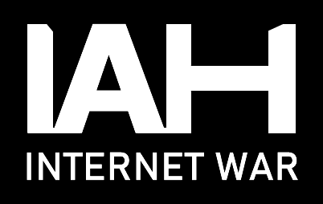
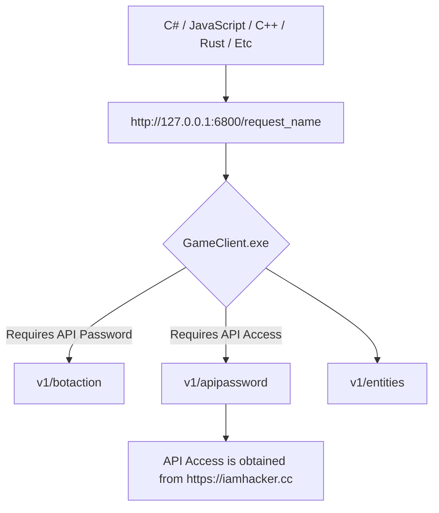

   

IAH: INTERNET WAR is a futuristic strategy game you can play using a programming language or a computer mouse.

Participate in tournaments and stand a chance to win prizes that can change your life.

For programmers seeking a competitive challenge, IAH offers algorithmic multiplayer. Create or join competitive clubs, write code solo or collaborate in a group, and use your preferred IDE and programming language to wage highly competitive algorithmic wars.

 

Steam Page

**https://store.steampowered.com/app/304770/IAH_INTERNET_WAR/**

Website

**https://iamhacker.cc/**

PvP API Documentation Wiki:

https://github.com/VitaliKirpu/IAH_PvPAITemplate/wiki/IAH:-INTERNET-WAR-%7C-PVP-AI-API

